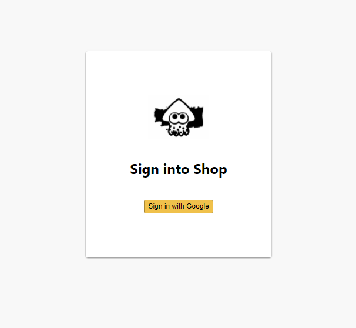
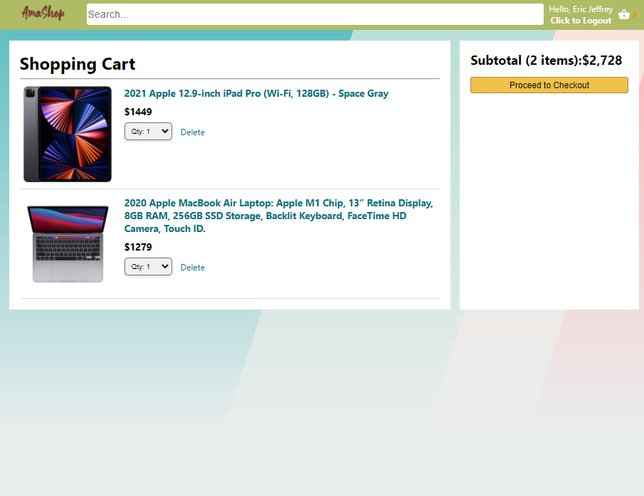

# React E-commerce: AmaShop

## Description

This project showcases a user friendly e-commerce website. The user will login with their Google account to see all the items in the home page. The user is able to add items to the cart and delete them before their purchases.

### Note: 

This is not a real shopping site. It is only for showing a basic e-commerce user experience, therefor the checkout button does not have any functionality.

## Guides

Click login with your Google account.

On the home page, the user can search for the name of the item that is listed in the content section. Click on the "add to cart" button to put the items in the shopping cart. Click the user name to logout.

On the cart page, the user can change the qunatity of the added items or delete them.

The Proceed to Checkout button does not have any function.

## Deployment

["AmaShop"](https://clone-dc0c9.web.app/)